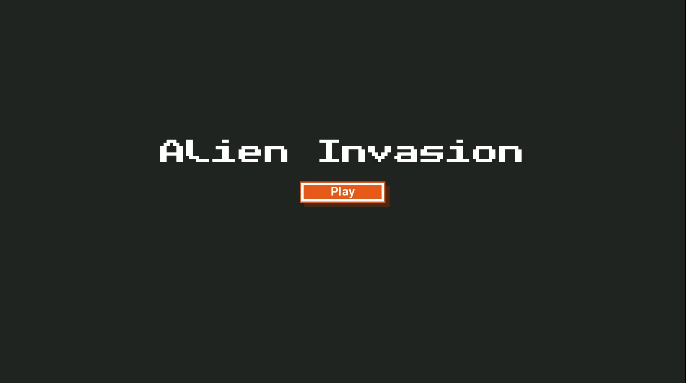
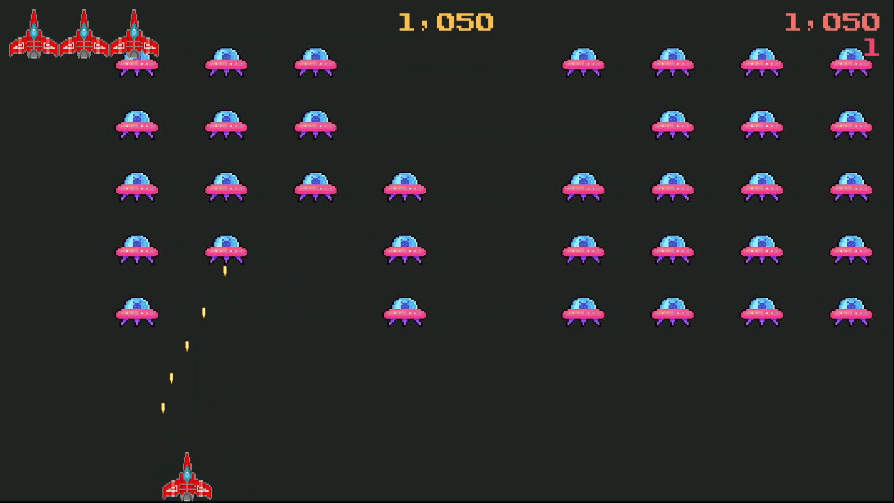

# Alien Invasion Game 🚀✨

Welcome to the Alien Invasion Game! This is a thrilling game built using Python's **pygame** library, where you defend the Earth from waves of alien invaders. As you progress through levels, the game becomes more challenging, with the aliens increasing their speed! ⚡🚫

## Gameplay 🎮

Use your spaceship to shoot down aliens and protect the Earth. 🛸

Clear all the aliens on the screen to move to the next level. ⬆️

Avoid alien collisions or being hit by their projectiles to survive. ⚠️

## Installation 🔧

### Clone the repository:

```bash
git clone https://github.com/yourusername/alien-invasion-game.git
cd alien-invasion-game
```


### Install the required dependencies:
```bash
pip install -r requirements.txt
```

### Run the game:

```bash
python alien_invasion.py
```

## Preview 🔄


### 

<hr>

## Features 🔥

High Score Tracking: Keeps track of the highest score achieved. 🏆

Score Display: Shows your current score during gameplay. 🌟

Dynamic Difficulty: Aliens increase speed as you level up. 🚀

Level Progression: Clear waves of aliens to advance to the next level. 💥


## Controls ⚖️

Arrow Keys: Move your spaceship left and right. ⬅️➡️

Spacebar: Fire your weapon. 🔨

Q: Pause or exit the game. 🙅


Enjoy the game and aim for the highest score! 🚀🔥

